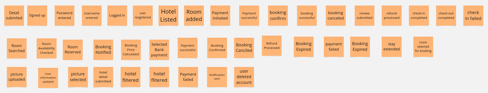
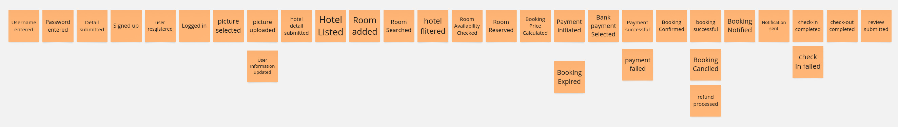
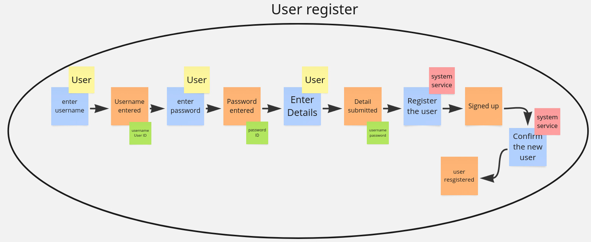
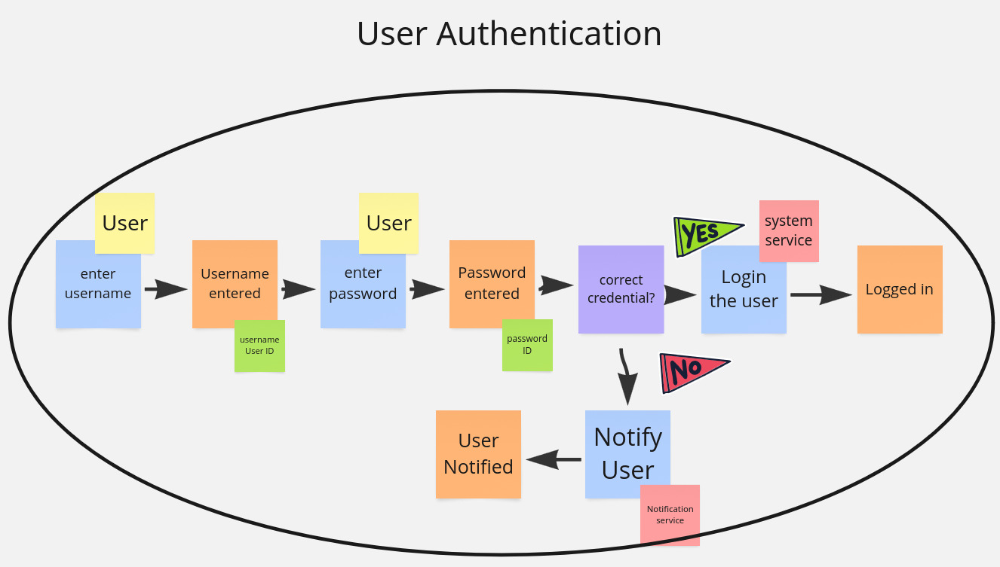
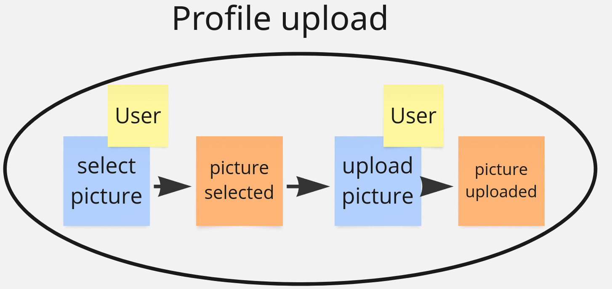
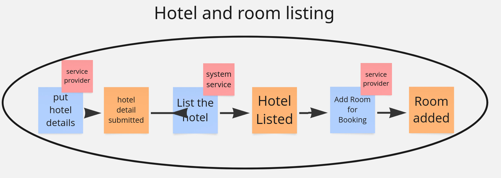
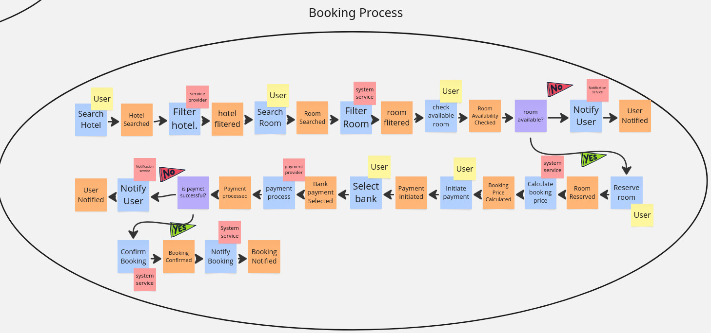
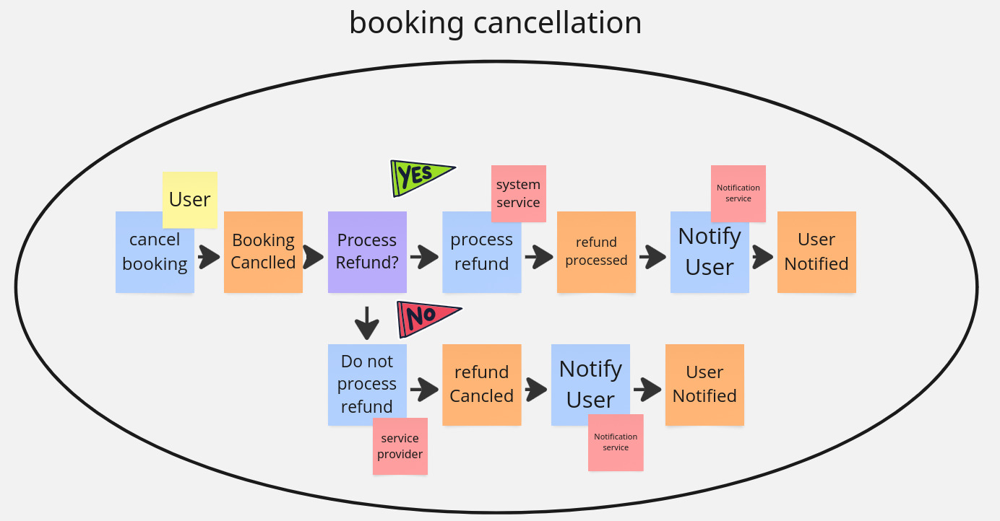
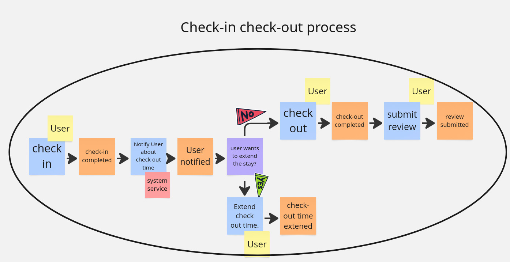

# Event Storming
# By: Team AC (Dechen Wangdra Sherpa & Tshering Phuntsho)
# Hotel Booking App

## Purpose of Event Storming:
This event storming is to map all key domain events in a structured sequence, ensuring a clear understanding of the system's workflow and dependencies. This should help in designing a well-structured and scalable hotel booking system. 

Link for MIRO: https://miro.com/welcomeonboard/bVdtelIvN2hQV25TMkcvQjBnN1B3SEVHQzhxQ2RGTEtJYUd3SkEyeENYa0ZMOWQvSkhQR2lTS3c0Q0Yvb050Q0JzOHVRSHFvYkhUL0VwSWNDcEM4cnRhaEhaRU9XdjFYV3NueTZNWXE3SXFTc3MvVlNKRjFtWkU0TjluZ0tCTk1hWWluRVAxeXRuUUgwWDl3Mk1qRGVRPT0hdjE=?share_link_id=996469533585

## Step 1 - Collect Domain Events

----
## Step 2 - Sequence Events

----
## Step 3 - Track Causes, Find Aggregates & Re-sort Them

### User Registration & Authentication

----
### User-Profile Upload

----
### Hotel and Room Listing

----
### Booking Process and Payment Process

----
### Booking Cancellation

----
### Check-in Check-out Process

